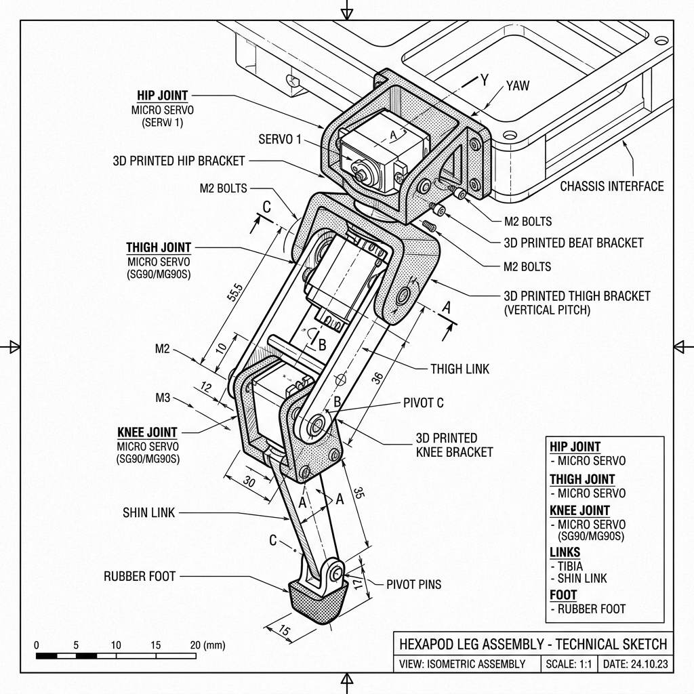

# Project NeuroHex: Chassis & Hardware Design

### Full Hexapod Assembly

### Single Leg Assembly

Based on the sketches generated for Project NeuroHex, here is a breakdown of what you'll need to 3D print and assemble.

## 3D Printed Parts Required

1. **The Main Baseplate (The "Thorax"):** 
   - Needs mounting holes for the Raspberry Pi.
   - Needs mounting slots underneath for the two PCA9685 I2C driver boards.
2. **Camera Mount (The "Head"):**
   - An angled bracket to hold the Pi Camera module at the very front of the robot. 
3. **The Leg Assemblies (Print 6x):**
   - **Hip Bracket:** Connects the Coxa servo to the main baseplate.
   - **Thigh Link:** Connects the Femur servo to the Tibia servo.
   - **Shin Link:** The actual lower leg that touches the ground.

## Off-the-Shelf Hardware

* **18x Micro Servos** (e.g., SG90 or MG90S)
* **Rubber Feet** (for the ends of the shin links for grip)
* **Standoffs & M2.5/M3 Screws**
