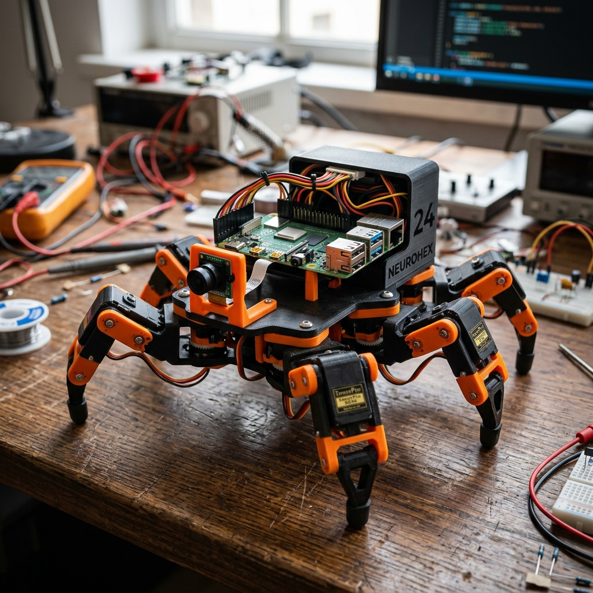
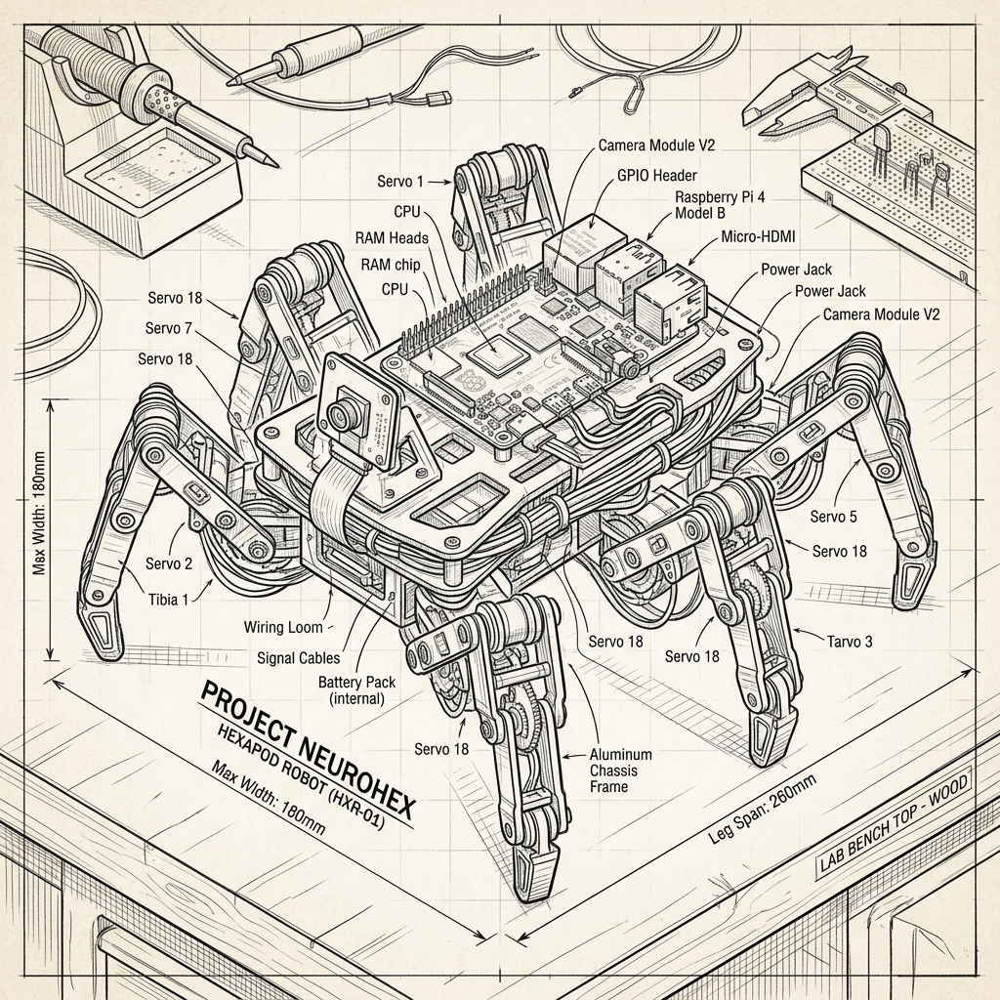
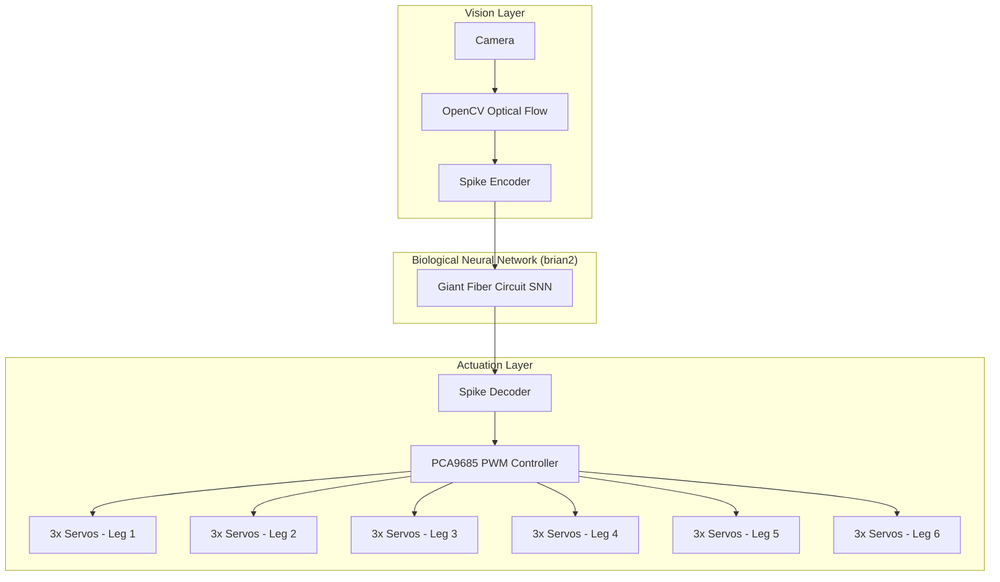
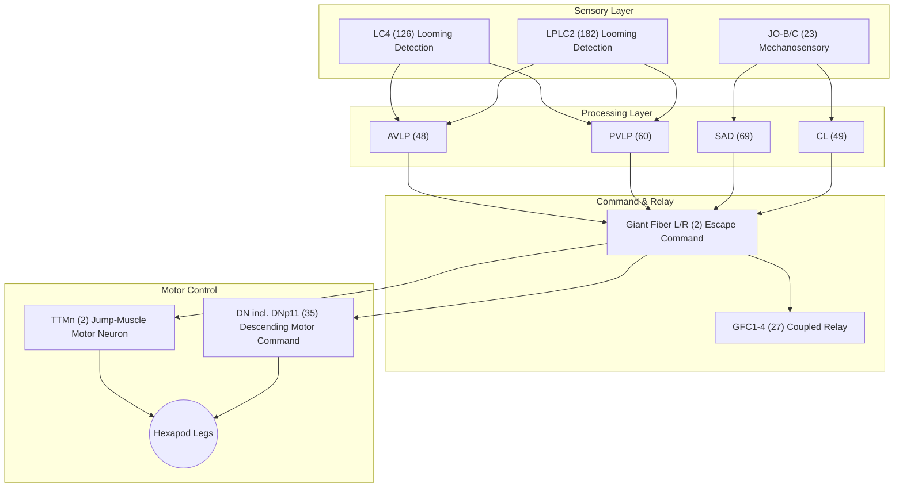
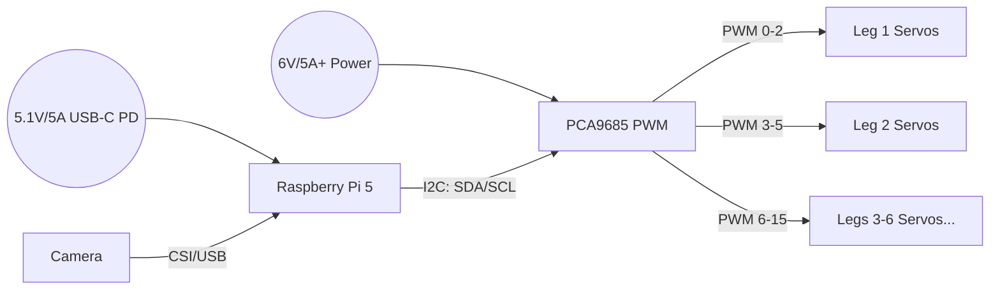

# NeuroHex 🪰🤖
> A biologically-driven hexapod robot powered by the fruit fly's real neural connectome


## 📌 Overview



Traditional biomimetic robots typically rely on hardcoded behavioral loops, finite state machines, or abstract artificial neural networks that loosely draw inspiration from biology. **NeuroHex** takes a radically different approach: it runs the LITERAL synaptic wiring diagram of a fruit fly (*Drosophila melanogaster*), downloaded directly from Virtual Fly Brain's **MaleCNS** whole-brain-and-nerve-cord reconstruction, to drive a physical hexapod robot based on the **Hexapod Nougat** chassis.

We only pull the direct (1-hop) synaptic neighborhood of the Giant Fiber escape circuit out of that ~166,000-neuron connectome, not the whole CNS, which would be far too large to simulate in real time on a Raspberry Pi.

By leveraging the **brian2** Spiking Neural Network (SNN) simulator, NeuroHex implements biologically plausible Leaky Integrate-and-Fire (LIF) neurons. The architecture models real physiological dynamics, mapping exact synaptic weights and connectivity from the fly's connectome.

The core demonstration of this platform is a **real-time escape response**. A camera detects looming objects (simulating a predator), visual neurons fire proportionally to the optical flow, and the signal cascades through the Giant Fiber escape circuit. Once the central escape command is triggered, motor neurons coordinate the hexapod legs to execute an immediate escape maneuver.

## Hardware & Architecture




## 🏗️ System Architecture

The robot bridges conventional machine vision with biological neural processing and physical actuation.



## 🧠 The Neural Circuit

This diagram outlines the biological signal flow, from sensory input down to motor output, using the exact neuron populations mapped from the fly brain.



> TTMn (tergotrochanteral motor neuron) is GF's classic "giant synapse" target: a near one-for-one, high-reliability connection that directly fires the jump muscle. GFC1-4 are captured as relay neurons in the simulated network, but their own downstream targets are outside the 1-hop scope we simulate.

## 📊 Connectome Coverage

To achieve real-time performance on a Raspberry Pi, we strategically isolated the escape circuitry while excluding metabolically/computationally expensive regions unnecessary for this specific reflex. Concretely, `fetch_connectome.py` pulls only the direct (1-hop) synaptic neighborhood of the Giant Fiber neurons out of the ~166,000-neuron MaleCNS reconstruction: everything else in the brain and nerve cord is left out.

### Included Neuron Groups (992 neurons)

| Group | Count | Biological Role | Function in Robot |
|-------|-------|----------------|------------------|
| **LPLC2** | 182 | Lobula plate columnar (looming) | Size × velocity computation |
| **LC4** | 126 | Looming-sensitive visual neurons | Collision detection from camera |
| **SAD** | 69 | Saddle interneurons | Sensory integration |
| **PVLP** | 60 | Posterior ventrolateral protocerebrum | Visual processing |
| **CL** | 49 | Clamp interneurons (incl. CL305) | Feedback modulation |
| **AVLP** | 48 | Anterior ventrolateral protocerebrum | Visual integration |
| **DN** | 35 | Descending neurons (incl. DNp11) | Brain → VNC motor command |
| **GFC1-4** | 27 | Giant Fiber coupled neurons | Motor relay (modeled, not read out) |
| **JO-B/C** | 23 | Johnston's Organ mechanosensory | Wind/vibration sensing |
| **Giant Fiber** | 2 | Central escape command neuron (L/R pair) | Escape trigger |
| **TTMn** | 2 | Tergotrochanteral motor neuron (L/R) | Fires the jump muscle directly |
| **Other** | 369 | Unclassified brain/VNC interneurons within 1 hop of GF | Supporting circuitry |

`motor_indices` in `snn_brain.py` reads out the **TTMn** and **DN** groups as the robot's escape command: these are GF's real, physically-verified motor targets in the VNC. GFC1-4 and the sensory/integration groups still participate in the simulated dynamics but aren't part of the output readout.

### Excluded Neuron Groups

| Group | ~Neuron Count | Role | Why Excluded |
|-------|--------------|------|-------------|
| **Mushroom Body** (KC, MBON, DAN) | ~2,500 | Learning & memory | Too computationally heavy; no learning needed for escape |
| **Central Complex** (EB, PB, FB) | ~1,000 | Navigation & heading | No compass needed for escape reflex |
| **Full Optic Lobe** (Mi, Tm, T4/T5) | ~40,000 | Low-level motion detection | We use OpenCV for preprocessing instead |
| **Antennal Lobe** (PN, LN) | ~350 | Olfactory processing | No olfactory sensor on robot |
| **Lateral Horn** | ~1,500 | Innate odor responses | No olfactory hardware |
| **Clock Neurons** (LNv, LNd) | ~150 | Circadian rhythm | Robot doesn't need sleep cycles |
| **Courtship Circuit** (P1, pC1) | ~200 | Mating behavior | Not applicable |
| **Feeding Circuit** | ~300 | Hunger/proboscis | No feeding apparatus |
| **Remaining VNC leg/wing motor circuitry** | ~23,000 | Fine-grained multi-leg motor coordination | Only GF's direct 1-hop targets (TTMn, DN) are modeled; the Python gait layer, not further spiking neurons, maps the escape command onto all 18 leg servos |

## 🛠️ Hardware Setup

- **Compute:** Raspberry Pi 5 (16GB RAM). The ~992-neuron escape circuit is tiny in comparison (a few thousand LIF neurons run in real time on far less), so the 16GB headroom is mainly for OpenCV frame buffers and comfortable dev/debug overhead, not the SNN itself.
- **Vision:** Pi Camera Module v2 or USB webcam
- **PWM Controller:** PCA9685 16-channel PWM board (I2C)
- **Actuators:** 18× SG90 micro servos (6 legs × 3 joints: coxa, femur, tibia)
- **Chassis:** Custom 3D-printed hexapod frame

> ⚠️ **IMPORTANT POWER WARNING:** You MUST use two separate power supplies! The Raspberry Pi 5 needs a full 5.1V/5A over USB-C PD: a 3A supply (the old Pi 4B spec) isn't enough and will cause it to throttle USB current or brown out. For untethered walking, that means a portable PD power bank explicitly rated for 5V/5A (see the BOM), not just any "PD" or "fast charging" bank -- most cap the 5V rung at 3A. Use a separate, robust 6V/5A+ supply for the PCA9685 to drive the servos. If you power the servos from the Pi, you will cause brownouts and SD card corruption.



## 💻 Software Stack

- **Python 3.11+**
- **vfb-connect:** Virtual Fly Brain API client for fetching connectome data
- **brian2:** Spiking Neural Network simulator for biological dynamics
- **OpenCV:** Camera input and optical flow calculation
- **adafruit-circuitpython-servokit:** Servo control via PCA9685 over I2C
- **NumPy & Pandas:** Data processing and matrix operations

## 🚀 Quick Start

```bash
# Clone the repository
git clone https://github.com/ColumbiaRobotics/project-neurohex.git
cd project-neurohex

# Install dependencies
pip install -r requirements.txt

# Download and parse the biological connectome
python fetch_connectome.py

# Run the full robot control loop (camera -> SNN -> servos)
python main.py

# Or run each layer standalone for development/testing:
python snn_brain.py     # brain only, synthetic ramping stimulus, no camera/servos
python vision.py        # camera only, prints the looming signal each frame
python motor_control.py # servo layer only, a scripted stand/lunge/stand smoke test
```

Each layer degrades gracefully with no hardware attached: `vision.py` falls back to a synthetic expanding-circle stimulus if no camera is available, and `motor_control.py` falls back to logging the servo commands it would have sent if no PCA9685/I2C hardware is detected (e.g. when developing on a laptop rather than the Pi itself). `main.py` uses whichever is actually available, so the exact same code runs on a dev machine and on the robot.

## 📁 Project Structure

```text
project-neurohex/
├── README.md                         # This file
├── AGENT_INSTRUCTIONS.md             # AI agent context & constraints
├── requirements.txt                  # Python dependencies
├── fetch_connectome.py               # Queries VFB API (MaleCNS) for adjacency matrices
├── snn_brain.py                      # Core brian2 SNN simulation (NeuroHexBrain)
├── vision.py                         # Camera -> optical-flow looming signal (LoomingDetector)
├── motor_control.py                  # Escape magnitude -> PCA9685 servo commands (HexapodController)
├── main.py                           # Ties the three layers together into the robot control loop
├── connectome_data/                  # Generated by fetch_connectome.py
│   ├── adjacency_matrix.npy          # N×N synapse count matrix
│   ├── neuron_metadata.json          # Neuron IDs, labels, groups, indices
│   └── connection_list.json          # Edge list with weights
└── hardware/
    └── 3d_models/                    # STL files for chassis (coming soon)
```

## ⚙️ How It Works

1. **Connectome Retrieval:** `fetch_connectome.py` queries the Virtual Fly Brain API to download the precise adjacency matrix for the targeted escape circuit.
2. **Network Initialization:** `snn_brain.py` maps the adjacency matrix into biologically plausible Leaky Integrate-and-Fire (LIF) neurons in the `brian2` simulator.
3. **Sensory Transduction:** The camera captures frames, and OpenCV computes optical flow to detect expanding (looming) shapes.
4. **Spike Encoding:** Optical flow magnitude is converted into spike trains, fed directly into the LC4 and LPLC2 sensory neurons.
5. **Circuit Propagation:** Spikes propagate dynamically through the biological circuit. If the stimulus crosses the threshold, the Giant Fiber fires.
6. **Motor Execution:** The output spike rate of the Descending Neurons is decoded into PWM angles, commanding the servos to execute the pre-programmed escape gait.

## 🔭 Future Work

- **STDP Integration:** Add Spike-Timing-Dependent Plasticity for online learning and gait adaptation.
- **Navigation:** Integrate the Central Complex (CX) for heading maintenance and spatial navigation.
- **Simulation:** Build a 3D physics simulation in MuJoCo to train and validate neural circuits before hardware deployment.
- **Visual Expansion:** Incorporate the full optic lobe for robust, biological visual processing.

## 📚 References & Data Sources

- **Virtual Fly Brain:** [virtualflybrain.org](https://www.virtualflybrain.org/)
- **MaleCNS Dataset:** FlyEM Project (Janelia), in collaboration with the University of Cambridge, MRC Laboratory of Molecular Biology, and Google Research. [male-cns.janelia.org](https://male-cns.janelia.org/)
- **Citation:** *Sexual dimorphism in the complete connectome of the Drosophila male central nervous system.* bioRxiv (2025). DOI: [10.1101/2025.10.09.680999](https://www.biorxiv.org/content/10.1101/2025.10.09.680999v1)
- **GF-TTMn "giant synapse" physiology:** Trimarchi, J.R. & Schneiderman, A.M. (1993). *Giant fibre activation of an intrinsic muscle in the mesothoracic leg of Drosophila melanogaster.* Journal of Experimental Biology, 177, 149-167. See also Allen, M.J. et al. (2007), *The chemical component of the mixed GF-TTMn synapse in Drosophila melanogaster uses acetylcholine as its neurotransmitter*, European Journal of Neuroscience, on the mixed electrical/chemical "giant synapse" that `snn_brain.py`'s GF-to-motor weighting is modeled on.

## 📄 License

MIT License
