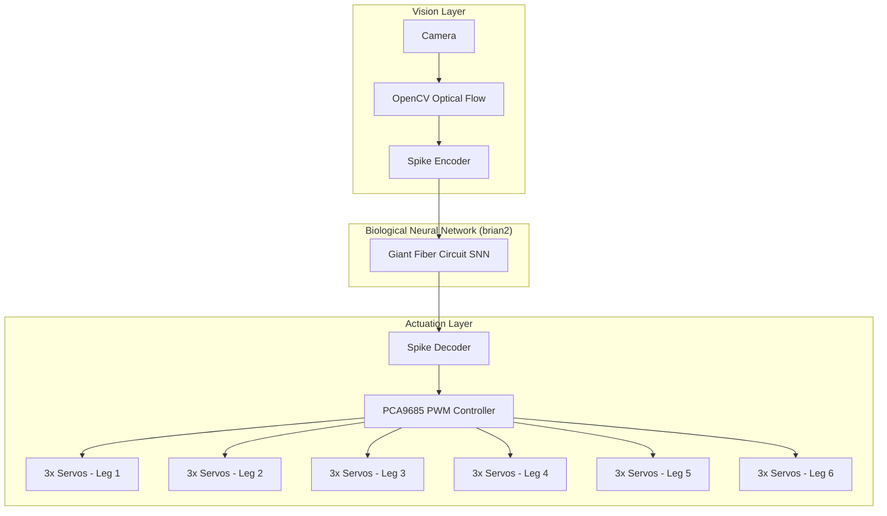
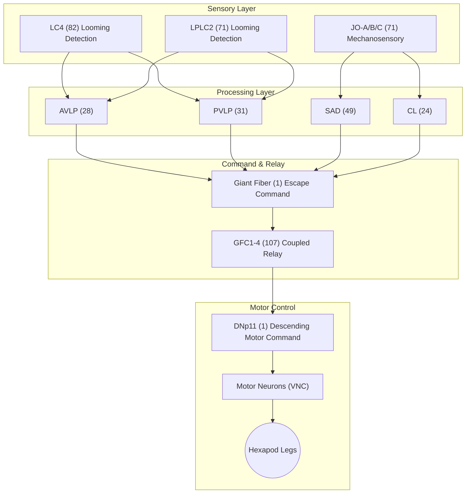
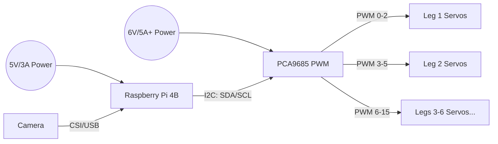

# NeuroHex 🪰🤖
> A biologically-driven hexapod robot powered by the fruit fly's real neural connectome


## 📌 Overview


Traditional biomimetic robots typically rely on hardcoded behavioral loops, finite state machines, or abstract artificial neural networks that loosely draw inspiration from biology. **NeuroHex** takes a radically different approach: it runs the LITERAL synaptic wiring diagram of a fruit fly (*Drosophila melanogaster*), downloaded directly from Virtual Fly Brain, to drive a physical hexapod robot based on the **Hexapod Nougat** chassis.

By leveraging the **brian2** Spiking Neural Network (SNN) simulator, NeuroHex implements biologically plausible Leaky Integrate-and-Fire (LIF) neurons. The architecture models real physiological dynamics, mapping exact synaptic weights and connectivity from the fly's connectome.

The core demonstration of this platform is a **real-time escape response**. A camera detects looming objects (simulating a predator), visual neurons fire proportionally to the optical flow, and the signal cascades through the Giant Fiber escape circuit. Once the central escape command is triggered, motor neurons coordinate the hexapod legs to execute an immediate escape maneuver.

## Hardware & Architecture


## 🏗️ System Architecture

The robot bridges conventional machine vision with biological neural processing and physical actuation.



## 🧠 The Neural Circuit

This diagram outlines the biological signal flow, from sensory input down to motor output, using the exact neuron populations mapped from the fly brain.



## 📊 Connectome Coverage

To achieve real-time performance on a Raspberry Pi, we strategically isolated the escape circuitry while excluding metabolically/computationally expensive regions unnecessary for this specific reflex.

### Included Neuron Groups (391 neurons)

| Group | Count | Biological Role | Function in Robot |
|-------|-------|----------------|------------------|
| **LC4** | 71 | Looming-sensitive visual neurons | Collision detection from camera |
| **LPLC2** | 82 | Lobula plate columnar (looming) | Size × velocity computation |
| **JO-A/B/C** | 71 | Johnston's Organ mechanosensory | Wind/vibration sensing |
| **AVLP** | 28 | Anterior ventrolateral protocerebrum | Visual integration |
| **PVLP** | 31 | Posterior ventrolateral protocerebrum | Visual processing |
| **SAD** | 49 | Superior anterior declivis | Sensory integration |
| **CL** | 24 | Clamp interneurons | Feedback modulation |
| **Giant Fiber** | 1 | Central escape command neuron | Escape trigger |
| **GFC1-4** | 107 | Giant Fiber coupled neurons | Motor relay |
| **DN** | 1 | Descending neuron (DNp11) | Brain → VNC motor command |
| **Other** | 26 | PS, PLP, WED, SMP, etc. | Supporting circuitry |

### Excluded Neuron Groups

| Group | ~Neuron Count | Role | Why Excluded |
|-------|--------------|------|-------------|
| **Mushroom Body** (KC, MBON, DAN) | ~2,500 | Learning & memory | Too computationally heavy; no learning needed for escape |
| **Central Complex** (EB, PB, FB) | ~1,000 | Navigation & heading | No compass needed for escape reflex |
| **Full Optic Lobe** (Mi, Tm, T4/T5) | ~40,000 | Low-level motion detection | We use OpenCV for preprocessing instead |
| **Antennal Lobe** (PN, LN) | ~350 | Olfactory processing | No olfactory sensor on robot |
| **Lateral Horn** | ~1,500 | Innate odor responses | No olfactory hardware |
| **Clock Neurons** (LNv, LNd) | ~150 | Circadian rhythm | Robot doesn't need sleep cycles |
| **Courtship Circuit** (P1, pC1) | ~200 | Mating behavior | Not applicable |
| **Feeding Circuit** | ~300 | Hunger/proboscis | No feeding apparatus |

## 🛠️ Hardware Setup

- **Compute:** Raspberry Pi 4B (4GB+ RAM)
- **Vision:** Pi Camera Module v2 or USB webcam
- **PWM Controller:** PCA9685 16-channel PWM board (I2C)
- **Actuators:** 18× SG90 micro servos (6 legs × 3 joints: coxa, femur, tibia)
- **Chassis:** Custom 3D-printed hexapod frame

> ⚠️ **IMPORTANT POWER WARNING:** You MUST use two separate power supplies! Use a 5V/3A supply for the Raspberry Pi, and a robust 6V/5A+ supply for the PCA9685 to drive the servos. If you power the servos from the Pi, you will cause brownouts and SD card corruption.



## 💻 Software Stack

- **Python 3.11+**
- **vfb-connect:** Virtual Fly Brain API client for fetching connectome data
- **brian2:** Spiking Neural Network simulator for biological dynamics
- **OpenCV:** Camera input and optical flow calculation
- **adafruit-circuitpython-servokit:** Servo control via PCA9685 over I2C
- **NumPy & Pandas:** Data processing and matrix operations

## 🚀 Quick Start

```bash
# Clone the repository
git clone https://github.com/ColumbiaRobotics/project-neurohex.git
cd project-neurohex

# Install dependencies
pip install -r requirements.txt

# Download and parse the biological connectome
python fetch_connectome.py

# Run the SNN and robot control loop
python snn_brain.py
```

## 📁 Project Structure

```text
project-neurohex/
├── README.md                         # This file
├── AGENT_INSTRUCTIONS.md             # AI agent context & constraints
├── requirements.txt                  # Python dependencies
├── fetch_connectome.py               # Queries VFB API for adjacency matrices
├── snn_brain.py                      # Core brian2 SNN simulation (NeuroHexBrain)
├── connectome_data/                  # Generated by fetch_connectome.py
│   ├── adjacency_matrix.npy          # N×N synapse count matrix
│   ├── neuron_metadata.json          # Neuron IDs, labels, groups, indices
│   └── connection_list.json          # Edge list with weights
└── hardware/
    └── 3d_models/                    # STL files for chassis (coming soon)
```

## ⚙️ How It Works

1. **Connectome Retrieval:** `fetch_connectome.py` queries the Virtual Fly Brain API to download the precise adjacency matrix for the targeted escape circuit.
2. **Network Initialization:** `snn_brain.py` maps the adjacency matrix into biologically plausible Leaky Integrate-and-Fire (LIF) neurons in the `brian2` simulator.
3. **Sensory Transduction:** The camera captures frames, and OpenCV computes optical flow to detect expanding (looming) shapes.
4. **Spike Encoding:** Optical flow magnitude is converted into spike trains, fed directly into the LC4 and LPLC2 sensory neurons.
5. **Circuit Propagation:** Spikes propagate dynamically through the biological circuit. If the stimulus crosses the threshold, the Giant Fiber fires.
6. **Motor Execution:** The output spike rate of the Descending Neurons is decoded into PWM angles, commanding the servos to execute the pre-programmed escape gait.

## 🔭 Future Work

- **STDP Integration:** Add Spike-Timing-Dependent Plasticity for online learning and gait adaptation.
- **Navigation:** Integrate the Central Complex (CX) for heading maintenance and spatial navigation.
- **Simulation:** Build a 3D physics simulation in MuJoCo to train and validate neural circuits before hardware deployment.
- **Visual Expansion:** Incorporate the full optic lobe for robust, biological visual processing.

## 📚 References & Data Sources

- **Virtual Fly Brain:** [virtualflybrain.org](https://www.virtualflybrain.org/)
- **Hemibrain Dataset:** Janelia FlyEM Project
- **Citation:** Scheffer, L.K., et al. (2020). *A connectome and analysis of the adult Drosophila central brain.* eLife.

## 📄 License

MIT License
