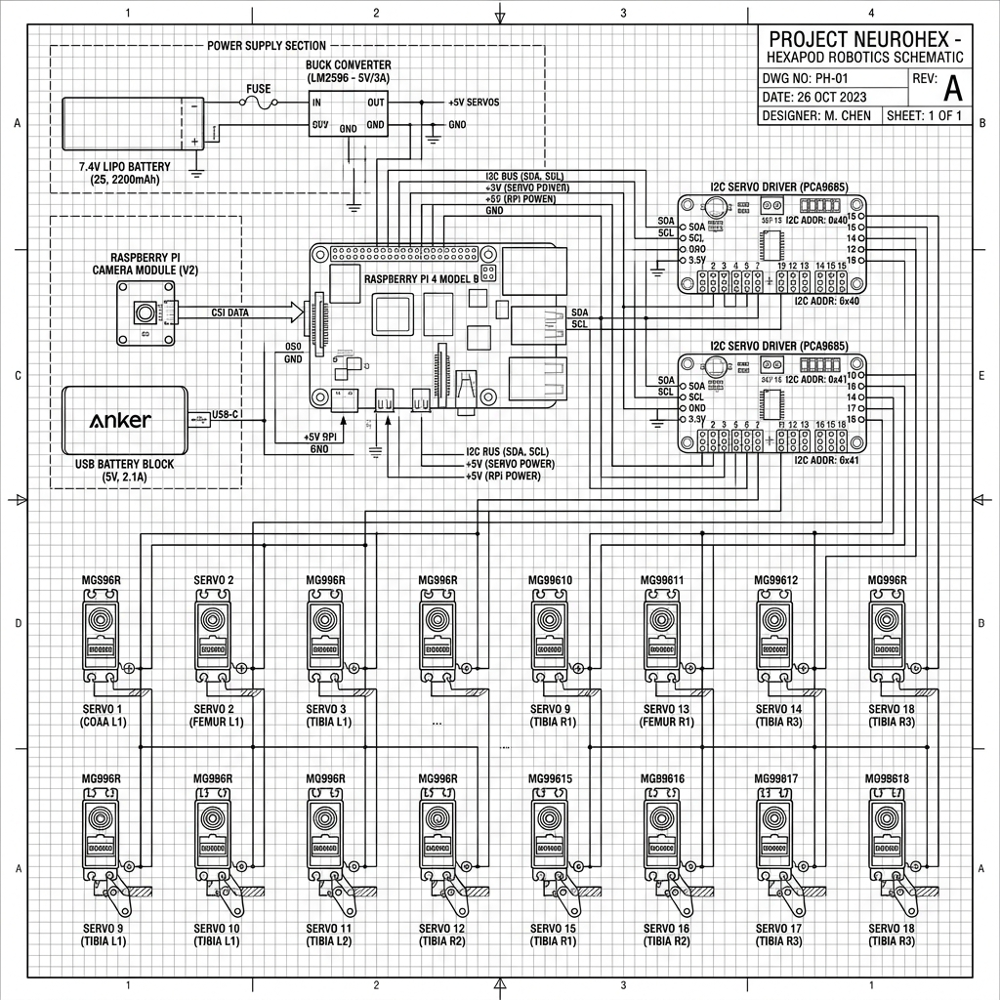
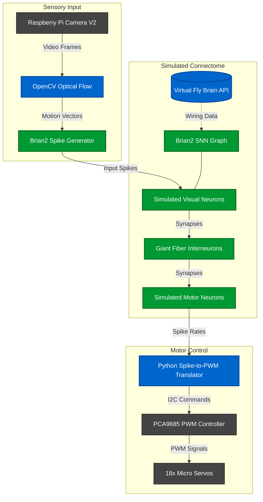
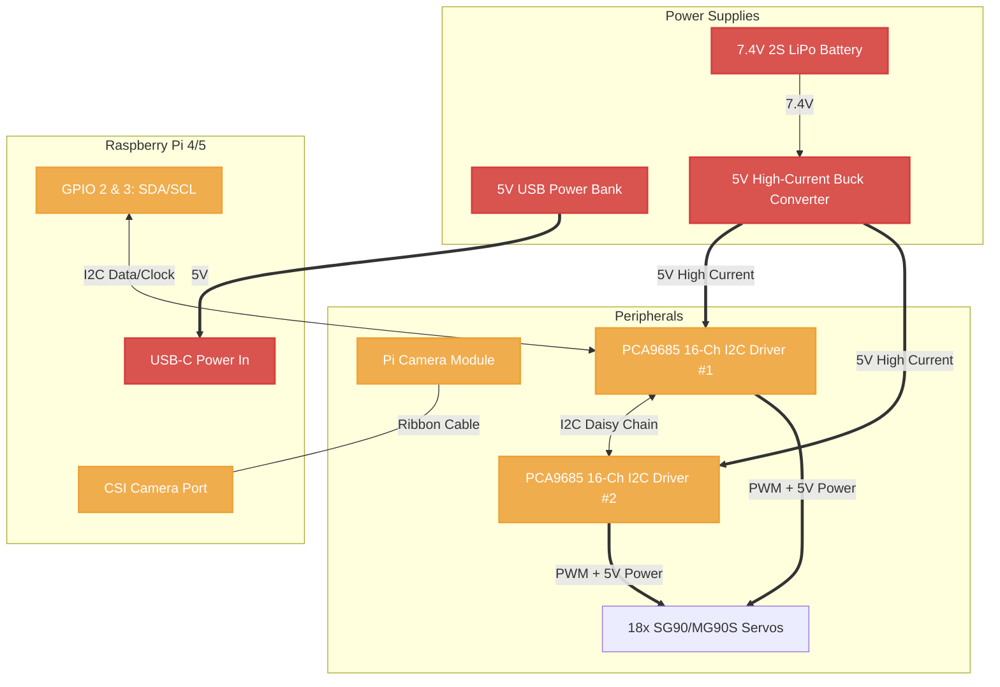
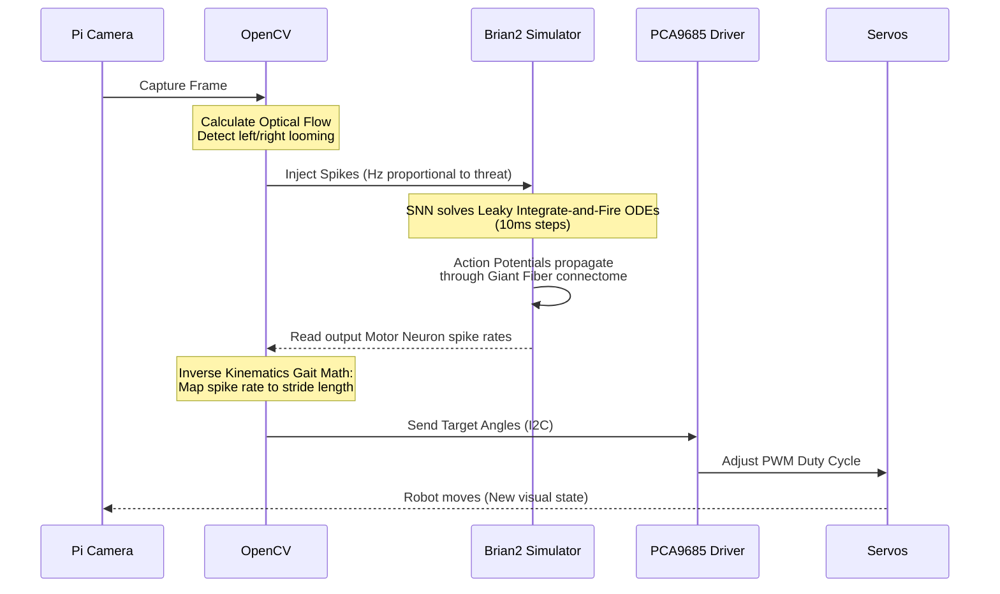

# Project NeuroHex: System Architecture & Schematics

This document provides detailed schematics of the entire NeuroHex system, breaking down the hardware wiring, the software data flow, and the physical power delivery.

---

## 1. High-Level System Architecture

This diagram shows how the physical hardware interfaces with the biological Spiking Neural Network (SNN).

---

## 2. Hardware & Wiring Schematic

This diagram details the physical pin connections and, crucially, the split power delivery system required to prevent the 18 servos from crashing the Raspberry Pi.

---

## 3. Spiking Neural Network (SNN) Data Flow

This outlines the translation layer logic inside the Python scripts.

